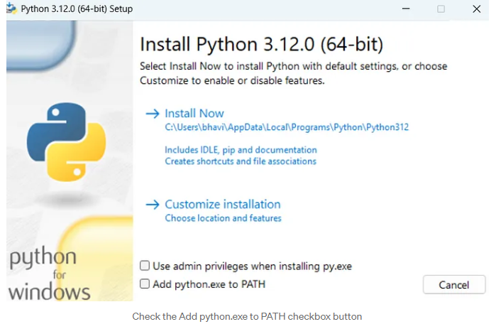

# SE-Assignment-6
 Assignment: Introduction to Python
Instructions:
Answer the following questions based on your understanding of Python programming. Provide detailed explanations and examples where appropriate.

 Questions:

1. Python Basics:
   - What is Python, and what are some of its key features that make it popular among developers? Provide examples of use cases where Python is particularly effective.

2. Installing Python:
   - Describe the steps to install Python on your operating system (Windows, macOS, or Linux). Include how to verify the installation and set up a virtual environment.

3. Python Syntax and Semantics:
   - Write a simple Python program that prints "Hello, World!" to the console. Explain the basic syntax elements used in the program.

4. Data Types and Variables:
   - List and describe the basic data types in Python. Write a short script that demonstrates how to create and use variables of different data types.

5. Control Structures:
   - Explain the use of conditional statements and loops in Python. Provide examples of an `if-else` statement and a `for` loop.

6. Functions in Python:
   - What are functions in Python, and why are they useful? Write a Python function that takes two arguments and returns their sum. Include an example of how to call this function.

7. Lists and Dictionaries:
   - Describe the differences between lists and dictionaries in Python. Write a script that creates a list of numbers and a dictionary with some key-value pairs, then demonstrates basic operations on both.

8. Exception Handling:
   - What is exception handling in Python? Provide an example of how to use `try`, `except`, and `finally` blocks to handle errors in a Python script.

9. Modules and Packages:
   - Explain the concepts of modules and packages in Python. How can you import and use a module in your script? Provide an example using the `math` module.

10. File I/O:
    - How do you read from and write to files in Python? Write a script that reads the content of a file and prints it to the console, and another script that writes a list of strings to a file.

# Submission Guidelines:
- Your answers should be well-structured, concise, and to the point.
- Provide code snippets or complete scripts where applicable.
- Cite any references or sources you use in your answers.
- Submit your completed assignment by [due date].

ANSWERS:

QUESTION 1: Python Basics

Python is a high-level, interpreted programming language known for its simplicity, readability, and versatility. Created by Guido van Rossum and first released in 1991, Python has gained widespread popularity among developers due to its straightforward syntax and extensive libraries, making it suitable for various applications from web development to data science.

Key Features of Python:
1. Simple and Readable Syntax:
   Python's syntax is clear and concise, making it easy to learn and use. The language emphasizes readability, which helps developers write clean and maintainable code.

   Example:
   def greet(name):
      print(f"Hello, {name}!")

   greet("Alice")

2. Interpreted Language:
   Python is an interpreted language, meaning code is executed line-by-line, which simplifies debugging and allows for rapid development.
   There is no need to compile the code before running it, which speeds up the development process.

3. Dynamic Typing
   Variables in Python are dynamically typed, meaning you do not need to declare the data type of a variable before using it.

   Example:
   
   x = 10
   x = "Hello, World!"

4. Extensive Standard Library
   Python has a rich standard library that provides modules and functions for various tasks such as file I/O, system calls, and web services.
   
   Example of an import statement:
   
   import os
   print(os.name)

5. Support for Multiple Programming Paradigms
   Python supports procedural, object-oriented, and functional programming paradigms.
   
   Example (Object-Oriented Programming):
   
   class Dog:
      def __init__(self, name):
         self.name = name
      
      def bark(self):
         print(f"{self.name} says woof!")

   my_dog = Dog("Buddy")
   my_dog.bark()

6. Extensive Community and Ecosystem
   Python has a large and active community, contributing to a vast ecosystem of third-party libraries and frameworks.
   Popular libraries include NumPy for numerical computations, Pandas for data manipulation, and Django for web development.

Use cases of Python:

1. Automation and Scripting:
   Python's simplicity makes it ideal for writing scripts to automate repetitive tasks.
   Example: Here is File renaming script below:

   import os
   for filename in os.listdir('.'):
      if filename.endswith('.txt'):
   os.rename(filename, f"renamed_{filename}")

2. Web Development:
   Python is widely used in web development, thanks to frameworks like Django and Flask.These frameworks are designed with specialized modules that allow developers to share data with servers and access databases. They can also enable routing, content management, and website security maintenance. Big websites like Instagram and Amazon make use of python to suggest content that their users like. Python can process large volumes of information and lots of traffic and it works quite well for photos.

3. Data Science and Machine Learning:
   Python is the preferred language for data scientists due to its powerful libraries such as NumPy, Pandas, Matplotlib, and Scikit-Learn. Performing complex statistical analysis can be done easily with Python because libraries would be available for what you want to do. Pandas and NumPy are the most common data analysis tools that allow you to perform a wide range of operations on your data, which include cleaning and wrangling it, exploring statistics, or visualizing hidden trends.

QUESTION 2: Installing Python

Steps to Install Python and verify Python installation on Windows:

1. Installing Python on Windows
Step 1: Download Python Installer
   - Go to the official Python website: https://www.python.org/

   - Navigate to the Downloads section and click on the Python version suitable for Windows.

Step 2: Run the Installer
- Open the downloaded file (python-xx.x.x.exe).

- Check the box that says "Use admin privileges when installing py.exe"

- Check the box that says "Add Python to PATH" at the bottom of the installation window. This ensures you can run Python from the command line.
- Click on "Install Now".

Step 3: Verifying the Installation of Python:
- Open Command Prompt (cmd).
- Type python --version and pip --version. You should see the installed Python and pip versions.

Steps to verify installation and set up of a Virtual Environment:
- Open Command Prompt. Navigate to your project directory: cd path\to\your\project.

- Create a virtual environment: python -m virtualenv my_env.

- Activate the virtual environment using the command below:
  my_env\Scripts\activate

- You will see (my_env) in your command line, indicating the virtual environment is active.

- You can also use the command below in command line to check the version of virtual environment installed:
  python -m virtualenv - -version

QUESTION 3: Python Syntax and Semantics:

Here is the python code and a detailed explanation of its components:

   # This is a simple Python program that prints "Hello, World!" to the console
   print("Hello, World!")

Explanation of Basic Syntax Elements:

- Comments: Comments are lines in the code that are not executed by the interpreter. They are used to explain the code and make it more readable. In Python, comments start with the # symbol.

- The print() Function: The print() function is used to output data to the console. It takes one or more arguments, which can be strings, numbers, or other data types. In our example, we pass a string "Hello, World!" to the print() function.

- Strings: Strings are sequences of characters enclosed in quotes (single or double quotes).
In our example, "Hello, World!" is a string.

QUESTION 4: Data Types and Variables:

This is a list of the most commonly used data types, along with brief descriptions and examples of how to use them:

1. Integers (int): Whole numbers without a fractional part.
2. Floating-Point Numbers (float): Numbers with a decimal point.
3. Strings (str): Ordered sequences of characters, enclosed in single or double quotes.
4. Booleans (bool): Logical values representing True or False.
5. Lists (list): Ordered collections of items, which can be of different data types.
6. Tuples (tuple): Ordered, immutable collections of items.
7. Sets (set): Unordered collections of unique items.
8. Dictionaries (dict): Unordered collections of key-value pairs.

Sample short scripts showing how to create and use variables  of different data types:

1. Integer (int): Used to represent whole numbers. Here is short script below and the output after running the code:

   age = 25
   print(age)  # Output: 25

2. Floating-Point Number (float): Used for numbers with a decimal point. Here is short script below and the output after running the code:

   price = 19.99
   print(price)  # Output: 19.99

3. String (str): Used for text. Strings are enclosed in quotes. Here is short script below and the output after running the code:

   name = "Alice is my Name"
   print(name)  # Output: Alice is my Name

4. Boolean (bool): Used for binary values, True or False. Here is short script below and the output after running the code:

   is_student = True
   print(is_student)  # Output: True

5. List (list): Ordered collection of items, which can be of different types. Lists are mutable. Here is short script below and the output after running the code:

   fruits = ["apple", "banana", "cherry"]
   print(fruits)  # Output: ['apple', 'banana', 'cherry']

6. Tuple (tuple): Ordered and immutable collection of items. Here is short script below and the output after running the code:

   coordinates = (10.0, 20.0)
   print(coordinates)  # Output: (10.0, 20.0)

7. Set (set): Unordered collection of unique items. Here is short script below and the output after running the code:
   unique_numbers = {1, 2, 3, 4, 5}
   print(unique_numbers)  # Output: {1, 2, 3, 4, 5}

8. Dictionary (dict): Unordered collection of key-value pairs. Here is short script below and the output after running the code:
   person = {
      "name": "John",
      "age": 30,
      "city": "New York"
   }

   print(person)  # Output: {'name': 'John', 'age': 30, 'city': 'New York'}

QUESTION 5: Control Structures:

Conditional Statements: Conditional statements in Python are used to execute a block of code only if a specified condition is true. The most common conditional statement is the if-else statement.

if-else Statement: The if-else statement allows you to execute a block of code if a condition is true and another block of code if the condition is false.

Syntax:
   if condition:
      # code block executed if condition is true
   else:
      # code block executed if condition is false

   Here is a sample code with a conditional statement:

   # Example of an if-else statement
   age = 18
   if age >= 18:
      print("You are an adult.")
   else:
      print("You are a minor.")

Explanation of the if-else statement: 

- The if statement checks if the condition (age >= 18) is true.
- If the condition is true, it executes the first block of code (print("You are an adult.")).
- If the condition is false, it executes the else block (print("You are a minor.")).

Loops: Loops in Python are used to repeat a block of code multiple times. A for loop is used to iterate over a sequence (such as a list, tuple, dictionary, set, or string) and execute a block of code for each element in the sequence.
   
Syntax:
for element in sequence:
   # code block executed for each element in sequence

Here is a Sample Code:
   # Example of a for loop
   numbers = [1, 2, 3, 4, 5]
   for number in numbers:
      print(number)

Explanation:
- The for loop iterates over each element in the numbers list.
- For each iteration, the current element (number) is printed.

  

QUESTION 6: Functions in Python

Functions are blocks of reusable code that perform a specific task. They are useful for breaking down complex problems into simpler, manageable parts and for avoiding repetition by allowing code to be reused. Functions improve code readability and maintainability.

Below is an example of a Python function add_numbers() that takes two arguments and returns their sum.
def add_numbers(a, b):
    """This function takes two arguments and returns their sum."""
    sum = a + b
    return sum

Calling the Function add_numbers(): now the function add_numbers() can be reused multiple times to add different sets of numbers as shown in the code below:

   result = add_numbers(5, 7)
   print(f"The sum of 5 and 7 is: {result}") # Output is 12

   result = add_numbers(10, 8)
   print(f"The sum of 10 and 8 is: {result}") # Output is 18

QUESTION 7: Lists and Dictionaries:

Lists and dictionaries are both built-in data structures in Python, but they serve different purposes and have different properties.

Lists:
- Definition: A list is an ordered collection of elements.
- Syntax: Lists are defined using square brackets [].
- Elements: Can contain items of different types (integers, strings, etc.).
- Indexing: Elements are accessed using their index, starting from 0.

Dictionaries:
- Definition: A dictionary is an unordered collection of key-value pairs.
- Syntax: Dictionaries are defined using curly braces {}.
- Keys and Values: Each key is unique and maps to a value. Keys must be immutable types (e.g., strings, numbers), while values can be of any type.
- Accessing Elements: Elements are accessed using their keys.

Basic Operations on Lists and Dictionaries:
Below are short snippets of Python scripts that demonstrate how to create and perform basic operations on lists and dictionaries.

Sample code for creating a List:
   # Creating a list of numbers
   numbers = [1, 2, 3, 4, 5]

Sample code for creating a Dictionary:
   # Creating a dictionary with key-value pairs
   student_grades = {
      "Alice": 90,
      "Bob": 85,
      "Charlie": 92
   }

Basic Operations on Lists
1. Accessing Elements

   # Accessing elements in a list
   print(f"First element in the list: {numbers[0]}")  # Output: 1
   print(f"Last element in the list: {numbers[-1]}")  # Output: 5

2. Adding Elements

   # Adding elements to a list
   numbers.append(6)  # Adding to the end
   print(f"List after appending 6: {numbers}")  # Output: [1, 2, 3, 4, 5, 6]

3. Removing Elements

   # Removing elements from a list
   numbers.remove(3)  # Removes the first occurrence of 3
   print(f"List after removing 3: {numbers}")  # Output: [1, 2, 4, 5, 6]

Basic Operations on Dictionaries
1. Accessing Values

   # Accessing values in a dictionary
   print(f"Alice's grade: {student_grades['Alice']}")  # Output: 90

2. Adding Key-Value Pairs

   # Adding a new key-value pair to the dictionary
   student_grades["David"] = 88
   print(f"Dictionary after adding David: {student_grades}") # Output: {'Alice': 90, 'Bob': 85, 'Charlie': 92, 'David': 88}

3. Removing Key-Value Pairs

   # Removing a key-value pair from the dictionary
   del student_grades["Bob"]
   print(f"Dictionary after removing Bob: {student_grades}") # Output: {'Alice': 90, 'Charlie': 92, 'David': 88}

QUESTION 8: Exception Handling:

Exception handling in Python is a mechanism to handle runtime errors, ensuring that the program can continue executing or fail gracefully without crashing. Exceptions are errors that occur during the execution of a program. Python provides a robust way to catch and handle these exceptions using try, except, and finally blocks.

Key Components of Exception Handling:
1. try block: The code that may raise an exception is placed inside the try block.
2. except block: This block catches and handles the exceptions that occur in the try block. You can specify the type of exception to catch.
3. finally block: This block contains code that will run regardless of whether an exception occurred or not. It is typically used for cleanup actions.

Example: Using try, except, and finally Blocks
Here’s a simple example that demonstrates how to use these blocks to handle exceptions in a Python script.
def divide_numbers(a, b):
    try:
        # Try to perform the division
        result = a / b
    except ZeroDivisionError as e:
        # Handle the specific exception
        print(f"Error: Division by zero is not allowed. {e}")
        result = None
    except TypeError as e:
        # Handle another specific exception
        print(f"Error: Invalid input type. {e}")
        result = None
    finally:
        # This block will run no matter what
        print("Execution of the try-except block is complete.")
    return result

# Test cases
print(divide_numbers(10, 2))  # Should print 5.0 and "Execution of the try-except block is complete."
print(divide_numbers(10, 0))  # Should print an error message and "Execution of the try-except block is complete."
print(divide_numbers(10, 'a'))  # Should print an error message and "Execution of the try-exce

QUESTION 9: Modules and Packages:

A module in Python is a file containing Python definitions and statements. Modules allow you to organize your Python code logically. They can include functions, classes, and variables, as well as runnable code. The primary purpose of modules is to break down large programs into smaller, manageable, and organized files.

- Creating a Module: Any Python file (.py file) is a module. 
- Using a Module: To use a module, you need to import it into your script.

Packages in Python: A package is a way of organizing related modules into a directory hierarchy. Packages are simply directories of modules that include a special __init__.py file, which can be empty, to indicate that the directory is a package.
Creating a Package: A package is a directory with a special __init__.py file.

Importing and Using a Module:
You can import modules using the import statement. You can also use from ... import ... to import specific attributes or functions from a module.

For example, the math module in Python provides access to mathematical functions defined by the C standard. 
Steps to Import and Use the math Module:
- Import the Module: Use the import statement.
- Use Functions from the Module: Call functions from the module using the dot notation (module_name.function_name).

Below is an example of how to import and use the math module in python:

   import math
   # Using the sqrt function to calculate the square root
   number = 16
   sqrt_result = math.sqrt(number)
   print(f"The square root of {number} is {sqrt_result}") 

   # Using the factorial function to calculate the factorial
   num = 5
   factorial_result = math.factorial(num)
   print(f"The factorial of {num} is {factorial_result}")

   # Using the pi constant to calculate the area of a circle
   radius = 3
   area = math.pi * (radius ** 2)
   print(f"The area of a circle with radius {radius} is {area:.2f}")

QUESTION 10: File I/O:

Reading from Files: To read from a file in Python, you can use the built-in open() function, which opens a file and returns a file object. There are different modes for opening a file: r for reading, w for writing (overwrites the file), a for appending, and r+ for both reading and writing.

Steps to Read a File:
- Open the file using the open() function.
- Read the content using methods like read(), readline(), or readlines().
- Close the file using the close() method.

Writing to Files: To write to a file, you also use the open() function, but with modes like w (write) or a (append).

Steps to Write to a File:
- Open the file using the open() function with write or append mode.
- Write the content using methods like write() or writelines().
- Close the file using the close() method.

Example Scripts
Script to Read from a File. Here’s a script that reads the content of a file and prints it to the console:

   # Script to read the content of a file and print it to the console

   # Open the file in read mode
   with open('example.txt', 'r') as file:
      # Read the content of the file
      content = file.read()
      
      # Print the content
      print(content)

Explanation:
- open('example.txt', 'r'): Opens the file example.txt in read mode.
- with: Ensures the file is properly closed after its suite finishes, even if an exception is raised.
- file.read(): Reads the entire content of the file.
- print(content): Prints the content of the file to the console.

Script to Write to a File. Here’s a script that writes a list of strings to a file:

   # Script to write a list of strings to a file

   # List of strings to write to the file
   lines = [
      "First line of text\n",
      "Second line of text\n",
      "Third line of text\n"
   ]

   # Open the file in write mode
   with open('output.txt', 'w') as file:
      # Write each line to the file
      file.writelines(lines)
      
   print("Lines written to output.txt")

Explanation:
- open('output.txt', 'w'): Opens the file output.txt in write mode. If the file does not exist, it creates a new file. If the file exists, it overwrites it.
- file.writelines(lines): Writes the list of strings to the file. Each string in the list represents a line in the file.
- print("Lines written to output.txt"): Prints a confirmation message to the console.

REFERENCES:

GeeksforGeeks. (n.d). Python Features. Retrieved June 21, from https://www.geeksforgeeks.org/python-features/

GeeksforGeeks. (n.d). Python OOPs Concepts. Retrieved June 21, from https://www.geeksforgeeks.org/python-oops-concepts/

Martinez J. (2024, February 4).Python Usecases - What is Python Best for?. datacamp. Retrieved June 21, from https://www.datacamp.com/blog/what-is-python-used-for

Gupta S. (2022, September 14). What is Python Used For? 9 Usecases[Overview Guide]. https://www.springboard.com/blog/data-science/what-is-python-used-for/

Idowu P. (2024, January 20). Creating Python Virtual Environment on Windows 11. Medium  Retrieved June 21, from https://medium.com/@ifeoluwapraise02/creating-python-virtual-environment-on-windows-11-5f60da64546f

Programiz. (n.d). Python Data Types (With Examples). Retrieved June 21, from https://www.programiz.com/python-programming/variables-datatypes

GeeksforGeeks. (n.d). For Loops in Python. Retrieved 2024, June 21, from https://www.geeksforgeeks.org/python-for-loops/

GeeksforGeeks. (n.d). Python Functions. Retrieved 2024, June 21, from https://www.geeksforgeeks.org/python-functions/

GeeksforGeeks. (n.d). Difference between Lists and Dictionaries in Python. Retrieved 2024, June 21, from https://www.geeksforgeeks.org/difference-between-list-and-dictionary-in-python/

GeeksforGeeks. (n.d). Python Exception Handling. Retrieved 2024, June 21, from https://www.geeksforgeeks.org/python-exception-handling/

GeeksforGeeks. (n.d). What’s the difference between Python’s module, package and library?. Retrieved 2024, June 21, from https://www.geeksforgeeks.org/what-is-the-difference-between-pythons-module-package-and-library/

GeeksforGeeks. (n.d). File Handling in Python. Retrieved 2024, June 21, from https://www.geeksforgeeks.org/file-handling-python/

